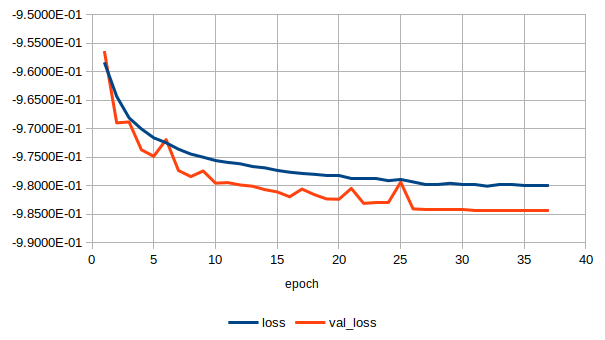

# Kaggle Carvana Image Masking Challenge solution with Keras
This solution was based on [Heng CherKeng's code for PyTorch](https://www.kaggle.com/c/carvana-image-masking-challenge/discussion/37208). I kindly thank him for sharing his work. 128x128, 256x256 and 512x512 U-nets are implemented. 128x128 U-net gets an LB score of 0.988.

---

## Requirements
* Keras 2.0 w/ TF backend
* sklearn
* cv2
* tqdm

---

## Usage

### Data
Place '*train*', '*train_masks*' and '*test*' data folders in the '*input*' folder.

Convert training masks to *.png* format. You can do this with: 

` mogrify -format png *.gif` 

in the '*train_masks*' data folder.

### Train
Run `python train.py` to train from scratch. Alternatively download [pre-trained weights for U-net_128](https://www.dropbox.com/s/7k2f734hxggyitb/best_weights.hdf5?dl=0) into '*weights*' folder.

### Test and submit
Run `python test_submit.py` to make predictions on test data and generate submission.

---

### Losses

